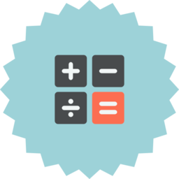
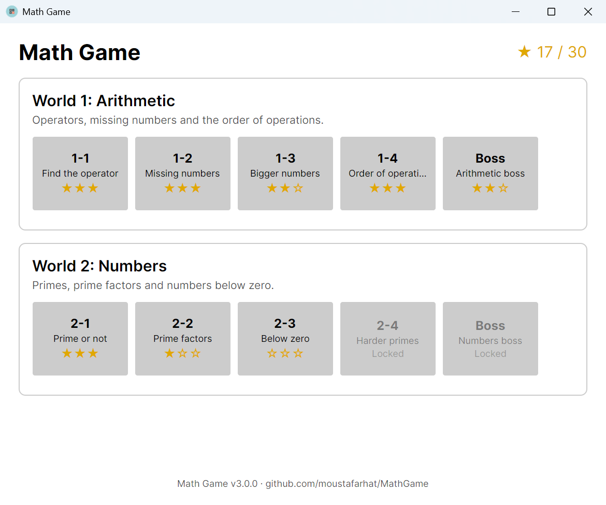
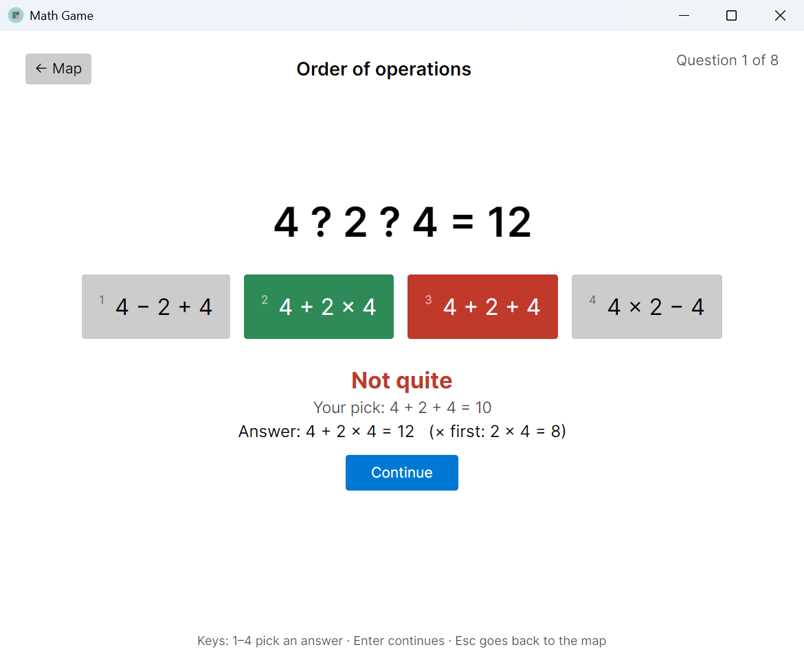

<div align="center">



# Math Game

**A free, open-source math puzzle game for Windows, macOS and Linux.**
Work through worlds of short stages, earn stars, beat the boss, and learn from every wrong answer.

[](https://github.com/moustafarhat/MathGame/actions/workflows/ci.yml)
[](https://github.com/moustafarhat/MathGame/releases/latest)
[](https://github.com/moustafarhat/MathGame/releases)
[](LICENSE)

[](https://dotnet.microsoft.com/)
[](CONTRIBUTING.md)

### [⬇ Download for Windows, macOS or Linux](https://github.com/moustafarhat/MathGame/releases/latest)

Free · Offline · No account, no ads, no tracking

 

</div>

## Why Math Game?

- **It teaches instead of just scoring.** After a wrong answer you see what your pick actually works out to, the right answer, and the step that matters, for example *"× first: 2 × 4 = 8"*.
- **It's fair.** If more than one answer is mathematically right, every one of them counts, and division questions always come out whole.
- **It grows with the player.** Stages get harder world by world, and each world ends in a boss stage that mixes everything you've learned.
- **It runs anywhere and keeps your data private.** Self-contained builds for every OS, with nothing to install. The game never goes online.
- **It's easy to extend.** A new kind of question is one small C# class; see [Adding a new kind of question](CONTRIBUTING.md#adding-a-new-kind-of-question).

## Worlds

| World | Stages | Example |
|---|---|---|
| **1 · Arithmetic** | Find the operator · Missing numbers · Bigger numbers · Order of operations · **Boss** | `4 ? 2 ? 4 = 12` |
| **2 · Numbers** | Prime or not · Prime factors · Below zero · Harder primes · **Boss** | `Which is the prime factorisation of 60?` |

More worlds are on the [roadmap](#roadmap).

## How to play

- **Pick an answer:** click it, or press `1`–`4`. The classic operator keys work too (`P` `M` `X` `D`, or `+` `-` `*` `/`), and `Y` / `N` answer "prime or not".
- **Type a number:** type it and press `Enter`. Both `-` and `−` work for negative numbers.
- A right answer moves on by itself. After a wrong one, read the explanation and press `Enter`.
- `Esc` takes you back to the map.

**Stars:** 60% correct earns ★, 80% earns ★★ and 95% earns ★★★. One star unlocks the next stage. Your best result per stage is saved locally.

## Download

Every release has ready-to-run builds on the [Releases page](https://github.com/moustafarhat/MathGame/releases/latest). No .NET installation is needed.

| Platform | File | How to start |
|---|---|---|
| Windows 10/11 | `MathGame-vX.Y.Z-win-x64.zip` | Unzip and run `MathGame.exe` |
| macOS (Apple Silicon) | `MathGame-vX.Y.Z-osx-arm64.zip` | Unzip, then open **Math Game** |
| macOS (Intel) | `MathGame-vX.Y.Z-osx-x64.zip` | Unzip, then open **Math Game** |
| Linux x64 | `MathGame-vX.Y.Z-linux-x64.tar.gz` | Extract and run `./MathGame` |

> **First launch:** the builds aren't code-signed yet.
> - On **macOS**, right-click **Math Game** → **Open** → **Open**.
> - On **Windows**, if SmartScreen appears, click **More info** → **Run anyway**.

## Build from source

You need the [.NET 10 SDK](https://dotnet.microsoft.com/download/dotnet/10.0).

```sh
git clone https://github.com/moustafarhat/MathGame.git
cd MathGame
dotnet run --project MathGame/MathGame.csproj   # play
dotnet test                                     # 130+ tests
```

### Project layout

```
MathGame.Core/        Game logic, no UI
├── Skills/           One class per kind of question (ISkill)
├── Stages/           stages.json: worlds, stages, difficulty
└── Play/             Playing a stage, stars, saved progress
MathGame/             Avalonia 12 desktop app (MVVM)
MathGame.Tests/       xunit tests, checked against an independent evaluator
```

### Releases are automatic

1. Bump `<Version>` in [`MathGame/MathGame.csproj`](MathGame/MathGame.csproj).
2. Add an entry to [CHANGELOG.md](CHANGELOG.md).
3. Merge to `master`.

The [Release workflow](.github/workflows/release.yml) then tests the app on each platform, packages Windows, Linux and both macOS builds (including a proper `.app` bundle), and publishes release `v<Version>` with release notes. Pushes that don't change the version don't create a release, and pull requests run the same packaging without releasing.

## Roadmap

- [x] Worlds 1–2: arithmetic, primes and negative numbers
- [x] Explanations for every wrong answer
- [x] Windows, macOS and Linux builds
- [ ] **World 3 · Fractions & percentages:** compare, simplify, equivalent fractions, percent of a number
- [ ] **World 4 · Powers & roots:** `2^? = 32`, estimating square roots
- [ ] **World 5 · Algebra:** balance-scale equations, `3x + 4 = 19`
- [ ] **World 6 · Sequences & patterns:** arithmetic and geometric sequences, what comes next?
- [ ] Speed stars and a timed challenge mode
- [ ] Adaptive difficulty and spaced review of weak skills
- [ ] Translations (Arabic, German, Spanish, …) and right-to-left layout
- [ ] Dark-mode polish and larger-text accessibility mode

Want one of these? 👍 the issue, or [build it](CONTRIBUTING.md). New skills are the best first contribution.

## Contributing

Contributions of every size are welcome: new question types, translations, bug reports and UI polish. Start with [CONTRIBUTING.md](CONTRIBUTING.md). Please follow the [Code of Conduct](CODE_OF_CONDUCT.md), and report security issues [privately](SECURITY.md).

If you like the game, **a ⭐ on the repo** helps other people find it.

## License

[MIT](LICENSE) © 2018-2026 Moustafa Farhat
